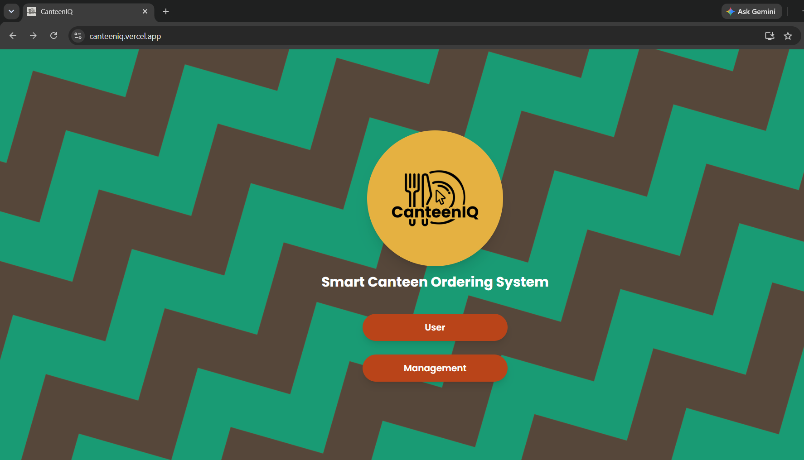
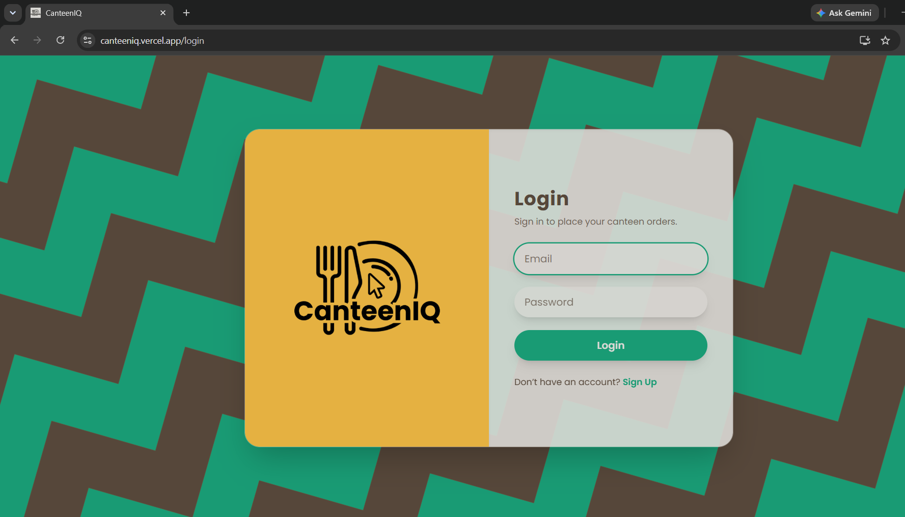
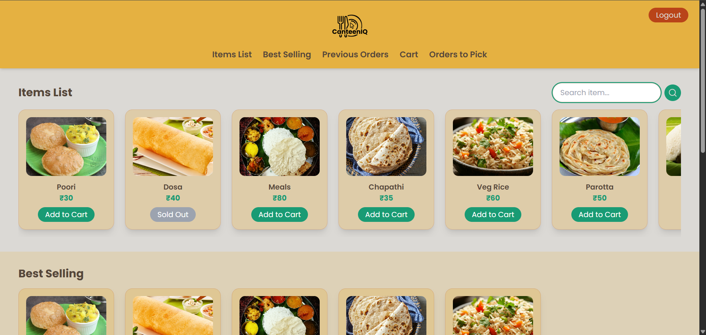
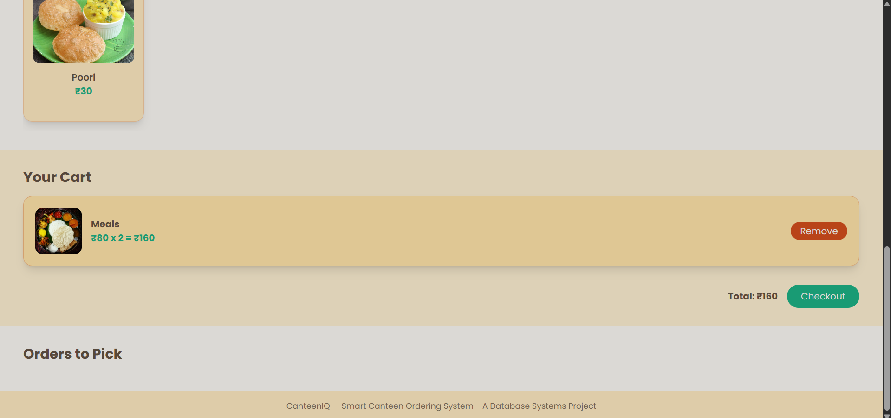
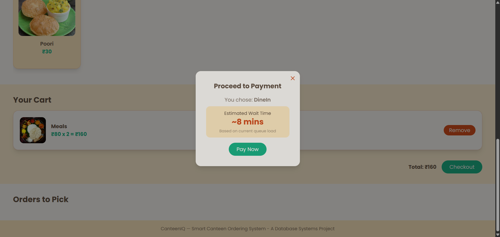
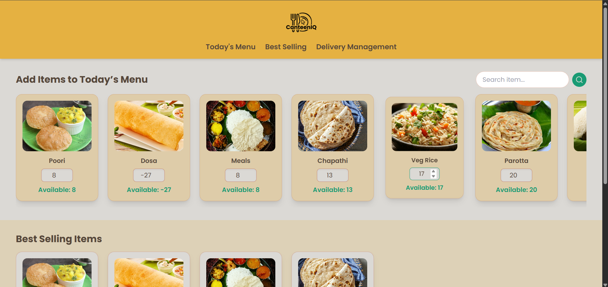
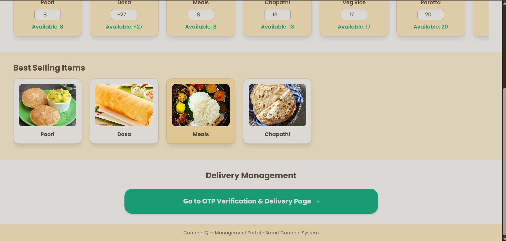
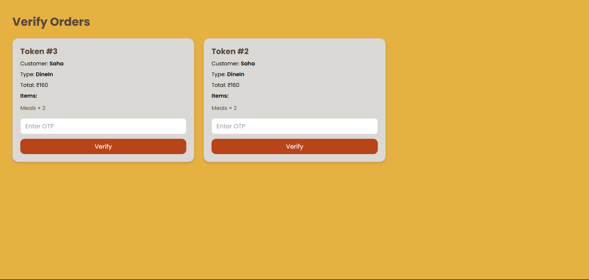

# CanteenIQ - Smart Canteen Ordering System

A full-stack canteen ordering platform that enables menu browsing, food ordering, OTP-based verification, waiting time estimation, and virtual queue management.

## Features

* Menu browsing and food ordering
* OTP-based verification
* Estimated waiting time calculation
* Virtual queue management
* Order tracking

## Tech Stack

**Frontend:** React.js, JavaScript, HTML, Tailwind CSS

**Backend:** Node.js, Express.js

**Database:** MongoDB

## Screenshots

| Login Page                      | User Login Page                      | Home Page                      |
| ------------------------------- | ------------------------------ | ------------------------------ |
|  |  |  |

| Home Page                      | Order               | Management Page              |
| ------------------------------- | ------------------------------- | ----------------------------- |
|  |  |  |

| Management Page                      | OTP verification Page                      |
| ---------------------------------- | --------------------------------- |
|  |  |

## Live Demo

https://canteeniq.vercel.app/

## Key Highlights

* Built a full-stack application using React.js, Node.js, Express.js, and MongoDB
* Developed responsive UI components using Tailwind CSS
* Built RESTful APIs for order processing and user verification
* Implemented OTP-based verification and virtual queue management
* Integrated MongoDB for order and user data management

## Future Scope

* Payment gateway integration for seamless transactions
* Enhanced queue prediction using historical order patterns and real-time demand analysis
* Order notifications and status updates
* Admin analytics dashboard
